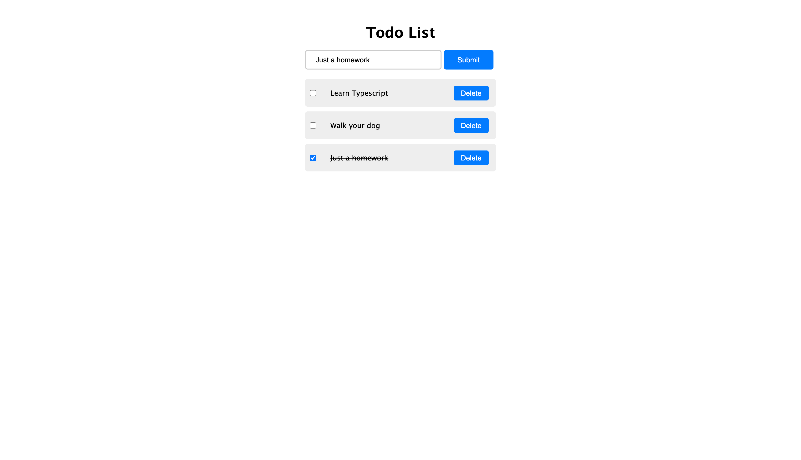

# Typescript MVC Todo

[](https://app.netlify.com/sites/typescript-mvc-todo/deploys)



### Prerequisites

`Git & NPM`

### Installation steps

```zsh
# clone the repo
git clone https://github.com/shimphillip/typescript-mvc-todo.git

# navigate to the directory
cd typescript-mvc-todo

# install packages
npm run dev

# build packages
npm run build
```

## Running the tests

```zsh
# runs the tests once
npm run test

# runs and watches the tests
npm run test:watch
```

## Deployment

Easy deployment with netlify :)

## Built With

- TypeScript
- Parcel Bundler

## Contributing

Issues/Bug Reports and PR's welcome!

## Authors

- Phillip Shim

## License

This project is licensed under the MIT License - see the [LICENSE.md](LICENSE.md) file for details

## Acknowledgments

1. https://www.taniarascia.com/javascript-mvc-todo-app/ - Tutorial inspiration from Tania Rascia
